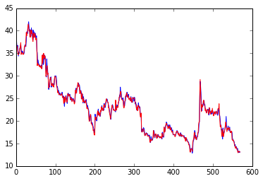
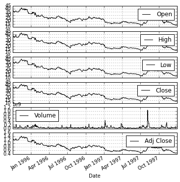
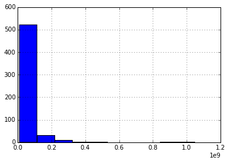
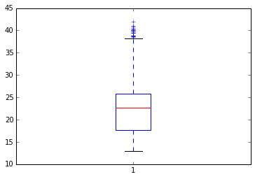
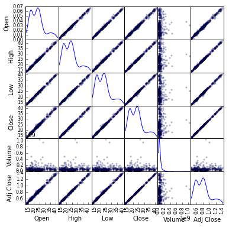
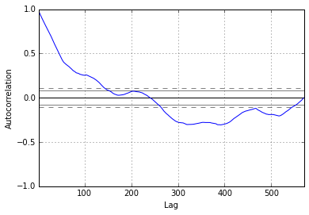
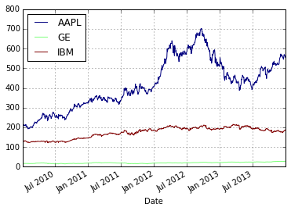

# Loading data

In this notebook, we will load some data from the Apple stock (aapl) from 1995
to 1998.

    import datetime
    import pandas as pd
    import pandas.io.data
    from pandas import Series, DataFrame
    from pandas.tools.plotting import scatter_matrix, autocorrelation_plot, radviz
    import matplotlib.pyplot as plt
    import matplotlib as mpl

    aapl = pd.io.data.get_data_yahoo('AAPL', 
                                     start=datetime.datetime(1995, 10, 1), 
                                     end=datetime.datetime(1998, 1, 1))
    aapl.head()

<table border="1" class="dataframe">
  <thead>
    <tr style="text-align: right;">
      <th></th>
      <th>Open</th>
      <th>High</th>
      <th>Low</th>
      <th>Close</th>
      <th>Volume</th>
      <th>Adj Close</th>
    </tr>
    <tr>
      <th>Date</th>
      <th></th>
      <th></th>
      <th></th>
      <th></th>
      <th></th>
      <th></th>
    </tr>
  </thead>
  <tbody>
    <tr>
      <th>1995-10-02</th>
      <td> 37.75</td>
      <td> 38.50</td>
      <td> 37.50</td>
      <td> 37.62</td>
      <td> 98000000</td>
      <td> 1.27</td>
    </tr>
    <tr>
      <th>1995-10-03</th>
      <td> 38.13</td>
      <td> 38.50</td>
      <td> 37.12</td>
      <td> 37.62</td>
      <td> 72455600</td>
      <td> 1.27</td>
    </tr>
    <tr>
      <th>1995-10-04</th>
      <td> 36.63</td>
      <td> 37.00</td>
      <td> 36.00</td>
      <td> 36.38</td>
      <td> 66693200</td>
      <td> 1.23</td>
    </tr>
    <tr>
      <th>1995-10-05</th>
      <td> 36.25</td>
      <td> 36.63</td>
      <td> 35.88</td>
      <td> 36.50</td>
      <td> 61017600</td>
      <td> 1.24</td>
    </tr>
    <tr>
      <th>1995-10-06</th>
      <td> 36.75</td>
      <td> 37.00</td>
      <td> 35.62</td>
      <td> 35.69</td>
      <td> 77260400</td>
      <td> 1.21</td>
    </tr>
  </tbody>
</table>

We now plot some of these columns

    plt.plot(aapl['Open'])
    plt.plot(aapl['Close'], color = 'r')
    plt.show()

    aapl.plot(subplots=True, figsize=(6, 6)); 

    aapl['Volume'].hist()

    <matplotlib.axes._subplots.AxesSubplot at 0x10bf4a150>

    plt.boxplot(aapl['Open'])

    {'boxes': [<matplotlib.lines.Line2D at 0x1129ce3d0>],
     'caps': [<matplotlib.lines.Line2D at 0x1129e3290>,
      <matplotlib.lines.Line2D at 0x1129e38d0>],
     'fliers': [<matplotlib.lines.Line2D at 0x1129c9590>],
     'means': [],
     'medians': [<matplotlib.lines.Line2D at 0x1129e3f10>],
     'whiskers': [<matplotlib.lines.Line2D at 0x1129ce550>,
      <matplotlib.lines.Line2D at 0x1129cec10>]}

Now, we create a scatter plot of all six columns. The (i,j) entry of this array
corresponds to plotting the i-th column against the j-th column. We can see,
with the exception of volume, there is a linear correlation between any pair of
columns. On the diagonal, we can see the density plot for each column.

    scatter_matrix(aapl, alpha=0.2, figsize=(6, 6), diagonal='kde')

    array([[<matplotlib.axes._subplots.AxesSubplot object at 0x1127b3250>,
            <matplotlib.axes._subplots.AxesSubplot object at 0x112742dd0>,
            <matplotlib.axes._subplots.AxesSubplot object at 0x112768f50>,
            <matplotlib.axes._subplots.AxesSubplot object at 0x1129cf810>,
            <matplotlib.axes._subplots.AxesSubplot object at 0x1127c6850>,
            <matplotlib.axes._subplots.AxesSubplot object at 0x112912f10>],
           [<matplotlib.axes._subplots.AxesSubplot object at 0x11292db10>,
            <matplotlib.axes._subplots.AxesSubplot object at 0x112952110>,
            <matplotlib.axes._subplots.AxesSubplot object at 0x112960a50>,
            <matplotlib.axes._subplots.AxesSubplot object at 0x112ee6190>,
            <matplotlib.axes._subplots.AxesSubplot object at 0x112f095d0>,
            <matplotlib.axes._subplots.AxesSubplot object at 0x112978b50>],
           [<matplotlib.axes._subplots.AxesSubplot object at 0x112f44290>,
            <matplotlib.axes._subplots.AxesSubplot object at 0x112f62f10>,
            <matplotlib.axes._subplots.AxesSubplot object at 0x112f816d0>,
            <matplotlib.axes._subplots.AxesSubplot object at 0x112fa5390>,
            <matplotlib.axes._subplots.AxesSubplot object at 0x112fb2f50>,
            <matplotlib.axes._subplots.AxesSubplot object at 0x11310b310>],
           [<matplotlib.axes._subplots.AxesSubplot object at 0x11312e750>,
            <matplotlib.axes._subplots.AxesSubplot object at 0x112fcbd50>,
            <matplotlib.axes._subplots.AxesSubplot object at 0x11316a410>,
            <matplotlib.axes._subplots.AxesSubplot object at 0x11318b0d0>,
            <matplotlib.axes._subplots.AxesSubplot object at 0x1131a7850>,
            <matplotlib.axes._subplots.AxesSubplot object at 0x1131ca510>],
           [<matplotlib.axes._subplots.AxesSubplot object at 0x1131d9110>,
            <matplotlib.axes._subplots.AxesSubplot object at 0x113606490>,
            <matplotlib.axes._subplots.AxesSubplot object at 0x1136298d0>,
            <matplotlib.axes._subplots.AxesSubplot object at 0x11318fcd0>,
            <matplotlib.axes._subplots.AxesSubplot object at 0x113664590>,
            <matplotlib.axes._subplots.AxesSubplot object at 0x113687250>],
           [<matplotlib.axes._subplots.AxesSubplot object at 0x1136a29d0>,
            <matplotlib.axes._subplots.AxesSubplot object at 0x1136c5690>,
            <matplotlib.axes._subplots.AxesSubplot object at 0x1136d6210>,
            <matplotlib.axes._subplots.AxesSubplot object at 0x113a04610>,
            <matplotlib.axes._subplots.AxesSubplot object at 0x113a24a50>,
            <matplotlib.axes._subplots.AxesSubplot object at 0x11368c950>]], dtype=object)

This is an autocorrelation plot for the openning value of the stock. The dashed
band shows the 99% confidence interval, and the sold line the 95%. In the
x-axis, we have values for different lags.

    autocorrelation_plot(aapl['Open'])

    <matplotlib.axes._subplots.AxesSubplot at 0x11d6f2350>

We now load stock data from Apple, General Electric and IBM, from January 1st
2011 to October 1st 2014.

    df = pd.io.data.get_data_yahoo(['AAPL', 'GE', 'IBM'], 
                                   start=datetime.datetime(2011, 1, 1), 
                                   end=datetime.datetime(2014, 10, 1))['Open']

    df.head()

<table border="1" class="dataframe">
  <thead>
    <tr style="text-align: right;">
      <th></th>
      <th>AAPL</th>
      <th>GE</th>
      <th>IBM</th>
    </tr>
    <tr>
      <th>Date</th>
      <th></th>
      <th></th>
      <th></th>
    </tr>
  </thead>
  <tbody>
    <tr>
      <th>2010-01-04</th>
      <td> 213.43</td>
      <td> 15.22</td>
      <td> 131.18</td>
    </tr>
    <tr>
      <th>2010-01-05</th>
      <td> 214.60</td>
      <td> 15.46</td>
      <td> 131.68</td>
    </tr>
    <tr>
      <th>2010-01-06</th>
      <td> 214.38</td>
      <td> 15.53</td>
      <td> 130.68</td>
    </tr>
    <tr>
      <th>2010-01-07</th>
      <td> 211.75</td>
      <td> 15.48</td>
      <td> 129.87</td>
    </tr>
    <tr>
      <th>2010-01-08</th>
      <td> 210.30</td>
      <td> 16.31</td>
      <td> 129.07</td>
    </tr>
  </tbody>
</table>

    df.columns.values

    array(['AAPL', 'GE', 'IBM'], dtype=object)

    df.plot(colormap='jet')

    <matplotlib.axes._subplots.AxesSubplot at 0x1210a0090>

